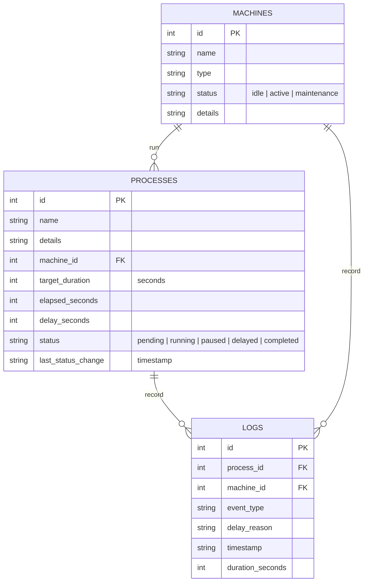

# 🏭 ShopFloor Automation Hub

An interactive dashboard for tracking, scheduling, and analysis of shopfloor manufacturing processes. Built with Python, Streamlit, and SQLite, this system models operations, monitors machine utilization, and logs process metrics.

---

## Project Overview

The ShopFloor Automation Hub is designed to digitize and monitor assembly line workflows. It solves the operational challenge of managing active production machines and processes by tracking elapsed running times, calculating delays, and generating visual analytics on equipment utilization.

*   **Premium Dark UI**: Styled using custom CSS overrides to deliver a glassmorphic aesthetic with high contrast glowing status indicators.
*   **Automatic Data Seeding**: Ready to run out of the box with zero setup—automatically seeds a new database on a clean clone.
*   **Operational Integrity**: Employs database-backed state machine logic to sync machine availability with active workloads on user interaction.

---

## Core Features

### ShopFloor Dashboard
*   **Status Matrix**: Monitor machines and workloads with live, pulsating visual LED indicators representing operational states (`Idle`, `Active`, `Maintenance`).
*   **Process Controllers**: Interactive actions for shopfloor operators to manage tasks (Start, Pause, Resume, and Complete production runs).
*   **Delay Reporting**: Ability to report delays with category selection (e.g., material shortage, mechanical failures).
*   **Running Metrics**: Calculates process run times and delays based on state transitions.

### Machine Registry
*   **Asset Management**: Add new machines with custom categories (Machining, Molding, Assembly, Cutting, etc.).
*   **Maintenance Controls**: Toggle machine statuses manually to put equipment offline for calibration or maintenance.

### Process Scheduler
*   **Job Queuing**: Schedule new production processes, map them to target machines, and specify target durations.
*   **Queue Overview**: Lists all upcoming processes waiting for machine availability.

### Analytics & Reports
*   **Machine Utilization & Delay Analytics**: Visualizes total active production time versus total delay time using interactive charts.
*   **Delay Reason Distribution**: Aggregates log entries to identify production bottlenecks (e.g. operator absence, power fluctuations).
*   **Audit Logging**: Full historical audit trail showing past transitions, times, and exact delay reasons.

---

## Technology Stack

*   **Frontend & Layout**: Streamlit with customized HTML/CSS injections for modern glassmorphism.
*   **Data Analysis & Plots**: Pandas and Plotly Express.
*   **Database Engine**: SQLite (native Python `sqlite3`).

---

## Repository Structure

```bash
Manufacturing_Process/
├── app.py              # Main dashboard UI, components, styling, and navigation
├── database.py         # DB schema initialization, data seeding, SQL queries, and states
├── .gitignore          # Excludes Python caches, local system logs, and SQLite DB files
└── README.md           # Project documentation and developer instructions
```

---

## Database Architecture

The backend operates on a relational SQLite database schema managed via [database.py](database.py).



*   **Self-Seeding Logic**: On a clean clone, running the application triggers `database.init_db()` which automatically creates `production.db` (omitted from repository tracking via `.gitignore`) and populates it with a set of default machines and processes.

---

## Getting Started

### 1. Prerequisites
Make sure you have **Python 3.8+** installed on your machine.

### 2. Installation
Clone the repository and install the required dependencies:
```bash
# Clone the repository
git clone https://github.com/Chinmayeemore/Manufacturing_Process.git
cd Manufacturing_Process

# Install dependencies
pip install streamlit pandas plotly
```

### 3. Running the App
Launch the Streamlit web application:
```bash
streamlit run app.py
```
The application will open in a new tab in your web browser (typically at `http://localhost:8501`).
